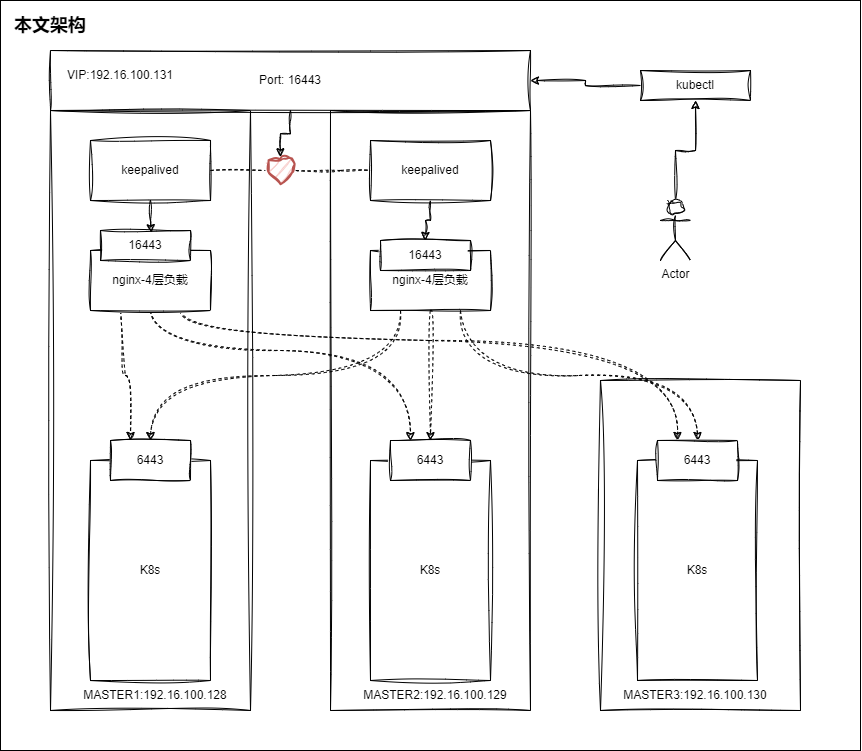
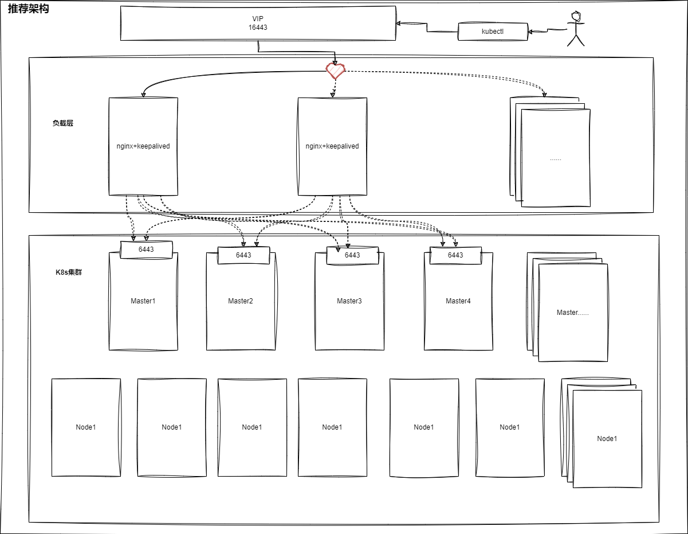

# 环境信息
由于个人主机原因只能操作三台主机进行项目演示，项目使用三个master节点作为k8s的控制节点，k8s的CRI全部使用containerd，生产环境中可以基于本文的基础上增加工作节点、者控制节点、负载节点。本项目把负载节点都放在了k8s节点中，生产环境建议把负载节点(nginx+keepalived)剥离出来，使用单独的节点做这部分，这里因为采用的是个人主机所以就放到一起了。具体拓扑信息和节点信息如下表和下图

| 角色    | 系统     | 规格 | 主机名  | IP                | 组件                            |
| ------- | -------- | ---- | ------- | ----------------- | ------------------------------- |
| Master1 | Rocky9.4 | 2H2G | node1   | 192.16.100.128/24 | k8s_master + nginx + keepalived |
| Master2 | Rocky9.4 | 2H2G | node2   | 192.16.100.129/24 | k8s_master + nginx + keepalived |
| Master3 | Rocky9.4 | 2H2G | node3   | 192.16.100.130/24 | k8s_master + nginx + keepalived |
| VIP     | 无       | 无   | k8s.vip | 192.16.100.131/24 | keepalived                      |



# 初始化节点
默认节点应该做到已经配好静态ip和配置好主机名的互通，学习环境中更简易修改hosts文件、生产环境中更建议通过DNS服务统一管理主机名。三台主机统一进行以下操作(下面内容可以直接粘贴到主机中)
```bash
# 安装基础软件包
yum install -y device-mapper-persistent-data lvm2 wget net-tools nfs-utils lrzsz gcc gcc-c++ make cmake libxml2-devel openssl-devel curl curl-devel unzip sudo chrony libaio-devel vim ncurses-devel autoconf automake zlib-devel python-devel epel-release openssh-server socat ipset ipvsadm conntrack telnet git yum-utils
# 关闭swap分区
swapoff -a
sed -i '/\sswap\s/s/^/#/' /etc/fstab
# 添加内核参数
# ipvs
mkdir /etc/sysconfig/modules/
cat > /etc/sysconfig/modules/ipvs.modules <<EOF
#!/bin/bash
modprobe -- ip_vs
modprobe -- ip_vs_rr
modprobe -- ip_vs_wrr
modprobe -- ip_vs_sh
modprobe -- nf_conntrack
EOF
chmod +x /etc/sysconfig/modules/ipvs.modules
/bin/bash /etc/sysconfig/modules/ipvs.modules
# netfilter
modprobe br_netfilter
cat > /etc/modules-load.d/k8s.conf <<EOF
br_netfilter
EOF
cat > /etc/sysctl.d/k8s.conf <<EOF
net.bridge.bridge-nf-call-ip6tables = 1
net.bridge.bridge-nf-call-iptables = 1
net.ipv4.ip_forward = 1
EOF
sysctl -p /etc/sysctl.d/k8s.conf
# 关闭防火墙
systemctl disable --now firewalld
setenforce 0
sed -i 's/SELINUX=enforcing/SELINUX=disabled/g' /etc/selinux/config
# 时间同步
echo "server ntp.aliyun.com iburst" >> /etc/chrony.conf
systemctl restart chronyd
```
# 组件安装
三台主机统一进行以下操作(下面操作可以直接粘贴到主机中)
```bash
# 阿里云的k8syum源
cat > /etc/yum.repos.d/kubernetes2.repo <<EOF
[kubernetes]
name=Kubernetes
baseurl=https://mirrors.aliyun.com/kubernetes-new/core/stable/v1.30/rpm/
enabled=1
gpgcheck=0
EOF
# 阿里云的docker源
yum-config-manager --add-repo https://mirrors.aliyun.com/docker-ce/linux/centos/docker-ce.repo
yum clean all
yum makecache
# 安装组件
yum -y install containerd.io-1.7.19 docker-ce kubelet-1.30.0 kubeadm-1.30.0 kubectl-1.30.0
```
# 组件配置
三台主机统一进行以下操作
```bash
# containerd.io
mkdir -p /etc/containerd
containerd config default > /etc/containerd/config.toml
# 修改/etc/containerd/config.toml
SystemdCgroup = false --> true
sandbox_image = "registry.k8s.io/pause:3.8" --> "registry.aliyuncs.com/google_containers/pause:3.8"
# 修改registry的config_path
	`
[plugins."io.containerd.grpc.v1.cri".registry]
  config_path = "" --> "/etc/containerd/certs.d"
`
# 创建docker.io加速配置目录
mkdir /etc/containerd/certs.d/docker.io/ -p
cat > /etc/containerd/certs.d/docker.io/hosts.toml <<EOF
[host."https://hmzadhg8.mirror.aliyuncs.com",host."https://docker.proxy.boychai.xyz"]
  capabilities = ["pull"]
EOF
systemctl enable --now containerd
# 配置docker加速目录
mkdir /etc/docker
cat > /etc/docker/daemon.json <<EOF
{
"registry-mirrors":["https://hmzadhg8.mirror.aliyuncs.com","https://docker.proxy.boychai.xyz"]
}
EOF
systemctl enable --now docker
systemctl enable kubelet

# 配置crictl工具配置
cat > /etc/crictl.yaml <<EOF
runtime-endpoint: unix:///run/containerd/containerd.sock
image-endpoint: unix:///run/containerd/containerd.sock
timeout: 10
debug: false
EOF
```
# 高可用配置
高可用需要在k8s安装好前配置，原因是k8s装好之后会去探测vip的存活，必须提前把负载和vip配置好。
```bash
# node1和node2执行下面内容 
yum install -y nginx keepalived nginx-mod-stream
# 备份
mv /etc/nginx/nginx.conf /etc/nginx/nginx.conf.bak
egrep -v "^*#|^$" /etc/nginx/nginx.conf.bak > /etc/nginx/nginx.conf
# 配置nginx四层负载
cat >> /etc/nginx/nginx.conf <<EOF
# 四层负载均衡，为三台Master apiserver组件提供负载均衡
stream {

    log_format  main  '$remote_addr $upstream_addr - [$time_local] $status $upstream_bytes_sent';

    access_log  /var/log/nginx/k8s-access.log  main;

    upstream k8s-apiserver {
            server node1:6443 weight=5 max_fails=3 fail_timeout=30s;
            server node2:6443 weight=5 max_fails=3 fail_timeout=30s;
            server node3:6443 weight=5 max_fails=3 fail_timeout=30s;

    }

    server {
       listen 16443; # 由于nginx与master节点复用，这个监听端口不能是6443，否则会冲突
       proxy_pass k8s-apiserver;
    }
}
EOF
systemctl enable --now nginx
```
在node1配置keepalived
```
# 修改keepalived的配置文件
vim /etc/keepalived/keepalived.conf
# 修改的内容基本上都是`vrrp_instance VI_1`中的值 修改如下
`
global_defs {
	...
	# vrrp_strict      # 这一行需要注释
	...
}
vrrp_script check_nginx { # 定义一个检查脚本,并且位置写进去,要注意的是这是个新增的配置
    script "/etc/keepalived/check_nginx.sh"
}
vrrp_instance VI_1 {
    state MASTER
    interface ens160      # 这里改成自己的网卡
    virtual_router_id 51  # 虚拟路由的id 每个实例都唯一
    priority 100          # 优先级
    advert_int 1          # VRRP心跳通告间隔时间 默认1秒
    authentication {
        auth_type PASS
        auth_pass 1111
    }
    virtual_ipaddress {
	    192.16.100.131/24
    }
    track_script {      # 这个是检查脚本 是新增的配置段
        check_nginx     # 脚本名字,脚本应该在配置中提前定义
    }
}
`
```
在node2配置keepalived
```
# 修改keepalived的配置文件
vim /etc/keepalived/keepalived.conf
# 修改的内容基本上都是`vrrp_instance VI_1`中的值 修改如下
`
global_defs {
	...
	# vrrp_strict      # 这一行需要注释
	...
}
vrrp_script check_nginx { # 定义一个检查脚本,并且位置写进去,要注意的是这是个新增的配置
    script "/etc/keepalived/check_nginx.sh"
}
vrrp_instance VI_1 {
    state BACKUP          # 这里改成BACKUP
    interface ens160      # 这里改成自己的网卡  
    virtual_router_id 51  # 虚拟路由的id 每个实例都唯一
    priority 90           # 优先级,需要比master低
    advert_int 1          # VRRP心跳通告间隔时间 默认1秒
    authentication {
        auth_type PASS
        auth_pass 1111
    }
    virtual_ipaddress {
        192.16.100.131/24
    }
    track_script {      # 这个是检查脚本 是新增的配置段
        check_nginx     # 脚本名字,脚本应该在配置中提前定义
    }
}
`
```
关于脚本中的内如如下，要注意的时候写好脚本需要给脚本添加执行权限`chmod +x /etc/keepalived/check_nginx.sh`
```/etc/keepalived/check_nginx.sh
#!/bin/bash
#1、判断Nginx是否存活
counter=$(ps -ef |grep nginx | grep sbin | wc -l )
if [ $counter -eq 0 ]; then
    #2、如果不存活则尝试启动Nginx
    service nginx start
    sleep 2
    #3、等待2秒后再次获取一次Nginx状态
    counter=$(ps -ef |grep nginx | grep sbin | wc -l )
    #4、再次进行判断，如Nginx还不存活则停止Keepalived，让地址进行漂移
    if [ $counter -eq 0 ]; then
        service  keepalived stop
    fi
fi
```
配置好之后都需要开启服务并且设置开机自启
```bash
systemctl enable --now keepalived
```
如果成功的话应该去keepalived的master节点查看ip应该有以下内容
```bash
[root@node1 keepalived]# ip a
......
2: ens160: <BROADCAST,MULTICAST,UP,LOWER_UP> mtu 1500 qdisc mq state UP group default qlen 1000
    link/ether 00:0c:29:dd:a9:fb brd ff:ff:ff:ff:ff:ff
    altname enp3s0
    inet 192.16.100.128/24 brd 192.16.100.255 scope global noprefixroute ens160
       valid_lft forever preferred_lft forever
    inet 192.16.100.131/24 scope global secondary ens160
       valid_lft forever preferred_lft forever
    inet6 fe80::20c:29ff:fedd:a9fb/64 scope link noprefixroute 
       valid_lft forever preferred_lft forever
......
```
重点是keepalived指定的网卡是否出现了一个指定的 ip，我这里指定的是`192.16.100.131/24`,这个就是vip。(需要注意的是这个ip应该提前做好DNS(k8s.vip))
# K8s安装
在Node1节点中执行以下内容
```bash
# 生成默认的k8s初始化文件
kubeadm config print init-defaults > kubeadm.yaml
# 在文件中分别注释以下内容
`
localAPIEndpoint:
  advertiseAddress: 1.2.3.4
  bindPort: 6443
nodeRegistration.name: node
`
# 修改以下内容(ClusterConfiguration)
imageRepository: registry.k8s.io --> registry.cn-hangzhou.aliyuncs.com/google_containers
# 增加以下内容(ClusterConfiguration)
featureGates.EtcdLearnerMode: false
controlPlaneEndpoint: k8s.vip:16443
networking.podSubnet: 10.244.0.0/16
# 追加以下内容
---
apiVersion: kubeproxy.config.k8s.io/v1alpha1
kind: KubeProxyConfiguration
mode: ipvs
---
apiVersion: kubelet.config.k8s.io/v1beta1
kind: KubeletConfiguration
cgroupDriver: systemd
# 编辑好后执行下面内容
kubeadm init --config=kubeadm.yaml
```
执行完毕会出现l类似于下面的字段
```bash
......
Your Kubernetes control-plane has initialized successfully!

To start using your cluster, you need to run the following as a regular user:

  mkdir -p $HOME/.kube
  sudo cp -i /etc/kubernetes/admin.conf $HOME/.kube/config
  sudo chown $(id -u):$(id -g) $HOME/.kube/config
......
```
根据提示执行下面命令
```bash
mkdir -p $HOME/.kube
sudo cp -i /etc/kubernetes/admin.conf $HOME/.kube/config
sudo chown $(id -u):$(id -g) $HOME/.kube/config
```
执行完毕之后第一个节点就创建好了。
工作节点怎么加入集群当前案例不再讲解，本文是三个控制节点。
在Node2和Node3中执行下面命令
```bash
mkdir -p /etc/kubernetes/pki/etcd &&mkdir -p ~/.kube/
```
在Node1节点通过直接执行下面命令把相关证书内容添加到另外两台主机中
```bash
for node in "node2" "node3"; do  
scp /etc/kubernetes/pki/ca.* $node:/etc/kubernetes/pki/;
scp /etc/kubernetes/pki/sa.* $node:/etc/kubernetes/pki/;
scp /etc/kubernetes/pki/front-proxy-ca.* $node:/etc/kubernetes/pki/;
scp /etc/kubernetes/pki/etcd/ca.* $node:/etc/kubernetes/pki/etcd/;
done
```
创建加入集群链接,在node1节点上执行下面内容获取加入链接
```bash
[root@node1 ~]# kubeadm token create --print-join-command
kubeadm join k8s.vip:16443 --token wde2hj.s6lew5852g2qa55e --discovery-token-ca-cert-hash sha256:9a9fae099f0cc5a92a40f40d794fa99b68592ba83dfb1a0ff398e77d44b122ea 
```
另外两台机器通过上面命令加入集群,要注意的是因为是加入当控制节点,所以需要加一个条参数`--control-plane`
```bash
kubeadm join k8s.vip:16443 --token wde2hj.s6lew5852g2qa55e --discovery-token-ca-cert-hash sha256:9a9fae099f0cc5a92a40f40d794fa99b68592ba83dfb1a0ff398e77d44b122ea --control-plane
```
成功会出现下面内容
```bash
This node has joined the cluster and a new control plane instance was created:

* Certificate signing request was sent to apiserver and approval was received.
* The Kubelet was informed of the new secure connection details.
* Control plane label and taint were applied to the new node.
* The Kubernetes control plane instances scaled up.
* A new etcd member was added to the local/stacked etcd cluster.

To start administering your cluster from this node, you need to run the following as a regular user:

        mkdir -p $HOME/.kube
        sudo cp -i /etc/kubernetes/admin.conf $HOME/.kube/config
        sudo chown $(id -u):$(id -g) $HOME/.kube/config

Run 'kubectl get nodes' to see this node join the cluster.
```
因为是控制节点如果想通过当前节点使用kubectl进行操作，就得需要执行他给的命令
```bash
        mkdir -p $HOME/.kube
        sudo cp -i /etc/kubernetes/admin.conf $HOME/.kube/config
        sudo chown $(id -u):$(id -g) $HOME/.kube/config
```
如果俩节点都没问题那么在在节点中使用下面命令应当返回下面内容
```bash
[root@node1 ~]# kubectl get node
NAME    STATUS     ROLES           AGE    VERSION
node1   NotReady   control-plane   77m    v1.30.0
node2   NotReady   control-plane   103s   v1.30.0
node3   NotReady   control-plane   20s    v1.30.0
```
接下来开始安装网络组件
```bash
# 下载calico的yaml文件
wget  https://docs.projectcalico.org/manifests/calico.yaml
# 修改配置 找到calico的这个配置,大概在4601行,可以通过vim的`/`查找
# - name: CALICO_IPV4POOL_CIDR
#   value: "192.168.0.0/16"
# 取消注释并且把之前kubeadm中规划的pod网络地址按照他的格式写上
- name: CALICO_IPV4POOL_CIDR
  value: "192.168.0.0/16"
# 安装到集群中
kubectl apply -f calico.yaml 
```
当执行下面命令发现node节点全部ready之后即网络组件安装完成
```bash
[root@node1 ~]# kubectl get node
NAME    STATUS   ROLES           AGE   VERSION
node1   Ready    control-plane   78m   v1.30.0
node2   Ready    control-plane   143s  v1.30.0
node3   Ready    control-plane   60s   v1.30.0
```

# 部分问题
## 关于containerd和k8s的对应版本
参考下面两个链接
[https://containerd.io/releases/#kubernetes-support](https://containerd.io/releases/#kubernetes-support)  
[https://github.com/containerd/containerd/blob/main/RELEASES.md#kubernetes-support](https://github.com/containerd/containerd/blob/main/RELEASES.md#kubernetes-support)

## CRI使用的containerd为什么安装docker？
当前k8s使用的containerd作为CRI，但是containerd不可以构建容器镜像，他俩同时安装是不冲突的，docker可以通过dockerfile进行构建容器镜像。

## featureGates.EtcdLearnerMode配置的作用？
在1.27之前的版本中，kubeadm额外加入集群的控制节点在做etcd同步的时候，在未同步完成的时候就会成为k8s的正式节点。1.27之后加入的这个参数，并且默认开启，在kubeadm额外加入集群的控制节点的时候etcd不会直接成为正式节点，而是成为学员节点，等待数据完全同步然后进行投票的形式来成为正式节点。
参考下面链接
https://github.com/kubernetes/kubeadm/issues/2997
https://kubernetes.io/blog/2023/09/25/kubeadm-use-etcd-learner-mode/


## 容器镜像怎么拉不下来？
现在网络环境，懂得都懂，本文使用的两个加速源，一个是我个人阿里云的url，还有一个是我自建的，可能稍微慢一些，出现容器镜像下载不下来的问题可以手动docker去pull，或者去找别的比较好用的加速地址。附上两个地址
阿里云： https://hmzadhg8.mirror.aliyuncs.com
自建： https://docker.proxy.boychai.xyz